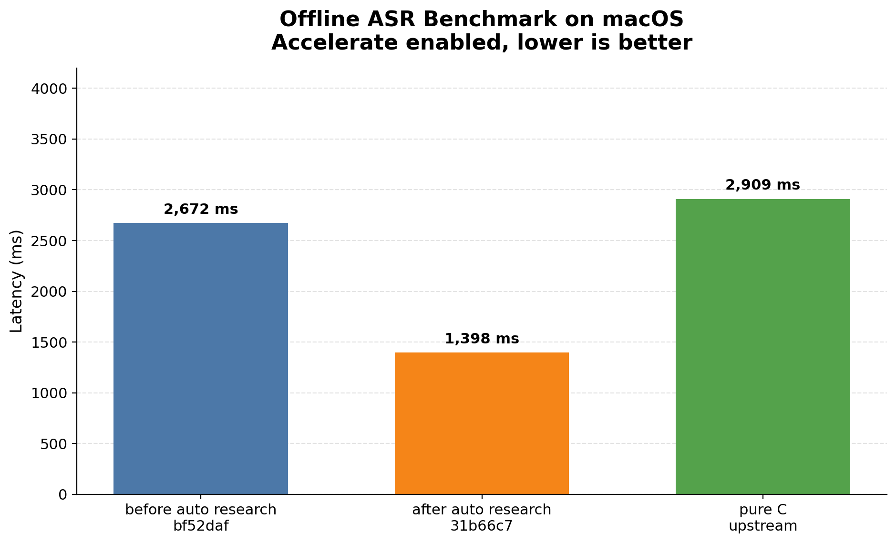
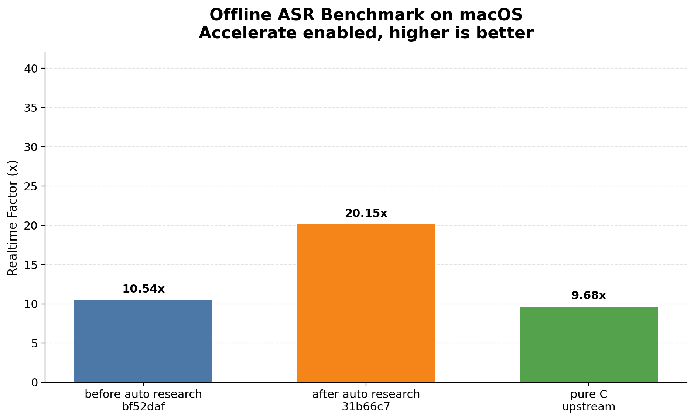

# qwen-asr

Pure Rust, CPU-only inference engine for [Qwen3-ASR](https://huggingface.co/Qwen/Qwen3-ASR-0.6B) speech-to-text. Zero runtime crate deps (only `libc`). Ported from [antirez/qwen-asr](https://github.com/antirez/qwen-asr).

Supports 0.6B and 1.7B models. Modes: offline, segmented, streaming, live capture, VAD live, forced alignment.

## Benchmark

Offline benchmark on macOS (Apple Silicon, Accelerate enabled, 3 runs best-of, 28.2s audio):

| Implementation | Commit | Total ms | Realtime Factor |
|---|---:|---:|---:|
| before auto research | `bf52daf` | 2,672 | 10.54x |
| after auto research | `31b66c7` | 1,398 | 20.15x |
| pure C upstream | - | 2,909 | 9.68x |





- **1.91x** faster than the pre-optimization baseline
- **2.08x** faster than the upstream pure C implementation

Reproduce with `./bench/benchmark-all.sh`.

## Auto Research

Performance optimizations were discovered autonomously using the [autoresearch](https://github.com/karpathy/autoresearch) pattern: an AI agent loops over hypothesize-implement-benchmark-keep/revert cycles on the inference code. The experiment protocol is defined in [`program.md`](program.md).

## Quick Start

```bash
# Install
cargo install qwen-asr-cli

# Download model
qwen-asr download qwen3-asr-0.6b

# Transcribe
qwen-asr -d qwen3-asr-0.6b -i audio.wav
```

Or download a pre-built binary from [GitHub Releases](https://github.com/huanglizhuo/QwenASR/releases).

## Usage

```
qwen-asr -d <model_dir> (-i <file> | --stdin | --live) [options]
```

```bash
qwen-asr -d qwen3-asr-0.6b -i audio.wav              # basic
qwen-asr -d qwen3-asr-0.6b -i audio.wav --silent      # transcript only
cat audio.wav | qwen-asr -d qwen3-asr-0.6b --stdin     # pipe from stdin
qwen-asr -d qwen3-asr-0.6b -i long.wav -S 30           # segmented (long audio)
qwen-asr -d qwen3-asr-0.6b -i audio.wav --stream       # streaming
qwen-asr -d qwen3-asr-0.6b --live --device "BlackHole 2ch"         # live capture (macOS)
qwen-asr -d qwen3-asr-0.6b --live --vad --device "BlackHole 2ch"   # VAD live
qwen-asr -d qwen3-aligner-0.6b -i audio.wav --align "Hello world" --align-language English  # alignment
ffmpeg -i video.mp4 -f s16le -ar 16000 -ac 1 - | qwen-asr -d qwen3-asr-0.6b --stdin        # raw PCM
```

<details>
<summary>All options</summary>

| Option | Description | Default |
|--------|-------------|---------|
| `-d <dir>` | Model directory (required) | — |
| `-i <file>` | Input WAV file | — |
| `--stdin` | Read audio from stdin (WAV or raw s16le 16kHz) | off |
| `--live` | Live capture from audio device (macOS) | off |
| `--device <name>` | Input device for live capture | system default |
| `--list-devices` | List audio input devices | — |
| `--vad` | VAD live mode | off |
| `-t <n>` | Thread count | all CPUs |
| `-S <secs>` | Segment target seconds | 0 (full) |
| `--stream` | Streaming mode | off |
| `--stream-chunk-sec <s>` | Chunk size for streaming | 2.0 |
| `--language <lang>` | Force output language (`en`, `zh`, `ja`, ...) | auto |
| `--silent` | Transcript only, no status output | off |
| `--profile` | Print timing breakdown | off |

</details>

## Build

**Always use release mode.** Debug builds are 10-50x slower.

```bash
# macOS
RUSTFLAGS="-C target-cpu=native" cargo build --release

# Linux
sudo apt install libopenblas-dev   # Debian/Ubuntu
RUSTFLAGS="-C target-cpu=native" cargo build --release

# Without BLAS
RUSTFLAGS="-C target-cpu=native" cargo build --release --no-default-features

# iOS (static library + C-FFI)
cargo build --release --target aarch64-apple-ios --features ios

# Android (shared library + JNI)
cargo ndk -t arm64-v8a build --release --features android
```

| Feature | Description |
|---------|-------------|
| `blas` (default) | BLAS linking (Accelerate on macOS, OpenBLAS on Linux) |
| `vdsp` | Accelerate vDSP/vForce for AMX (macOS) |
| `ios` | C-FFI API (`src/c_api.rs`) |
| `android` | JNI API (`src/jni_api.rs`) |

## OpenClaw Skill

One-command install for [OpenClaw](https://github.com/anthropics/openclaw) users:

```bash
bash skills/qwen-asr/scripts/install.sh
bash skills/qwen-asr/scripts/transcribe.sh audio.wav
```

## Acknowledgments

Rust port of [antirez/qwen-asr](https://github.com/antirez/qwen-asr), a pure C implementation of Qwen3-ASR inference by Salvatore Sanfilippo (antirez).

## License

Same license as [antirez/qwen-asr](https://github.com/antirez/qwen-asr).
