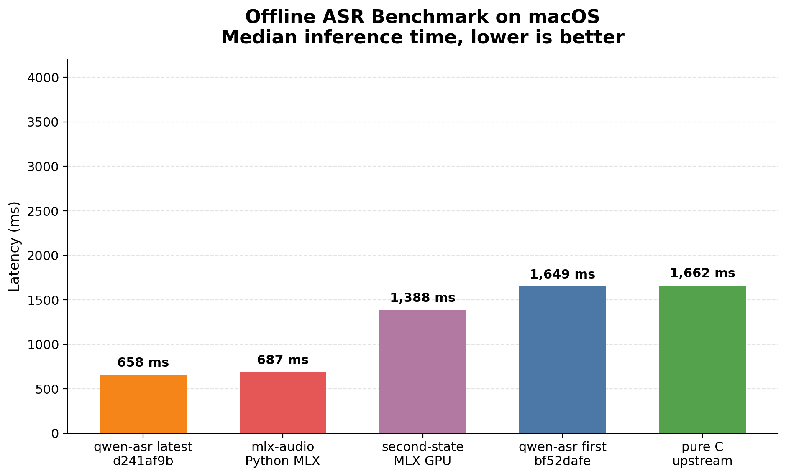
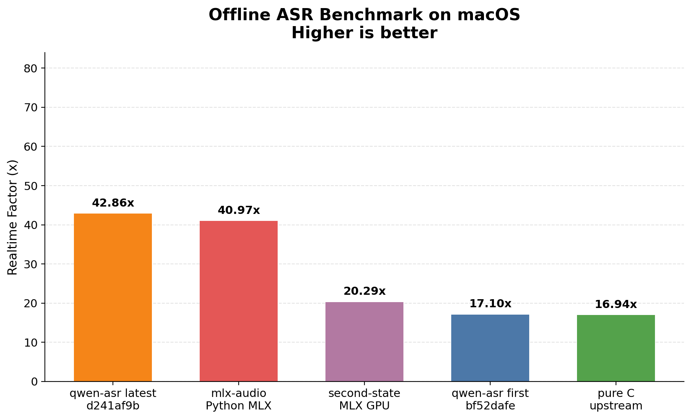

# Cross-Implementation Comparison

Apples-to-apples comparison of qwen-asr against the upstream pure C implementation and MLX-based baselines on the same audio and model.

## Methodology

- Offline benchmark on `bench/samples/audio.wav` (28.2 s, mono 16 kHz)
- Model: `qwen3-asr-0.6b`
- Implementations benchmarked sequentially, not in parallel
- Primary metric: median inference time across standalone rounds
- qwen-asr and pure C use internal inference timers; MLX-based implementations are timed after model load with explicit GPU synchronization
- Wall-clock time is retained as a secondary metric
- Default runs: 10

## Reproduce

```bash
./bench/benchmark-all.sh --runs 10
```

This script:
1. Builds qwen-asr first (`bf52daf`) and latest (current HEAD)
2. Clones/builds upstream C (`antirez/qwen-asr`)
3. Clones/builds `second-state/qwen3_asr_rs` (MLX backend)
4. Runs `mlx-audio` (MLX Python)
5. Normalizes results and renders `report.md` plus charts

Output: `bench/compare-results/<timestamp>/` with `report.md`, `summary.json`, charts, and raw logs.

> **Note:** the full comparison takes 30–60 minutes because it clones and builds three external implementations.

## Current qwen-asr HEAD

> Generated on: 2026-07-11
> Commit: `d241af9b`
> Runs: 10

| Mode | Median inference ms | Mean ms | Best ms | Realtime factor |
|---|---:|---:|---:|---:|
| offline | 563 | 568.8 | 557 | 50.09× |
| segmented | 572 | 570.4 | 559 | 49.30× |
| streaming | 544 | 544.3 | 531 | 51.89× |

Previous dedicated benchmark (`a7470a2`, full-transcript fix not yet applied in the saved run):

| Mode | Median inference ms | Mean ms | Best ms | Realtime factor |
|---|---:|---:|---:|---:|
| offline | 576 | 579.4 | 560 | 48.92× |
| segmented | 448 | 448.0 | 434 | 62.88× |
| streaming | 496 | 496.0 | 480 | 56.91× |

The saved `a7470a2` result stopped after 27 tokens (`WER=0.4324` on the speed sample) and is kept only as historical context. As of Round 11 (`d241af9b`) the full 46-token transcript is produced *and* the offline median (563 ms) is faster than that truncated run — the current offline/segmented transcripts match the sample reference exactly (`WER=0.0000`).

> Note: the `1d677db` fix removed the remaining punctuation/token-count early stop, so post-fix speed numbers are not directly comparable to earlier truncated rows.

See [`results.md`](./results.md) for the full speed-benchmark page.

## Latest Cross-Implementation Results

> Generated on: 2026-07-11 from `bench/compare-results/20260711T145612Z/`
> Runs per target: 10
> Hardware: Apple M5 Pro, 15 cores, 48 GB RAM, macOS 26.4
> Versions: upstream C `main` (`b00b789`), second-state `v0.2.0` (`0226270`), mlx-audio `v0.4.5`
> Results are sorted by median inference latency (fastest first).

| Implementation | Commit / Version | Median inference ms | Mean ms | Best ms | RTF |
|---|---:|---:|---:|---:|---:|
| qwen-asr (latest) | `d241af9b` | 658 | 668 | 629 | 42.86× |
| mlx-audio Python MLX | `0.4.5` | 687 | 750 | 682 | 40.97× |
| second-state MLX GPU | `0226270` (v0.2.0) | 1,388 | 1,466 | 1,378 | 20.29× |
| qwen-asr (first) | `bf52daf` | 1,649 | 1,651 | 1,630 | 17.10× |
| pure C upstream | `b00b789` | 1,662 | 1,661 | 1,637 | 16.94× |

> **Note:** the cross-implementation run passes `--threads 15` to every implementation, while the dedicated speed benchmark uses the binary default (12 on this machine). The dedicated benchmark reports `563 ms` / `50.09×` for qwen-asr latest offline; the full comparison reports `658 ms` / `42.86×`. Both current runs use `d241af9b` and produce the full transcript.

### Wall-clock timing

| Implementation | Commit / Version | Median wall-clock ms | Mean ms | Best ms | Wall-clock RTF |
|---|---:|---:|---:|---:|---:|
| qwen-asr (latest) | `d241af9b` | 932 | 976 | 901 | 30.25× |
| second-state MLX GPU | `0226270` (v0.2.0) | 1,593 | 1,736 | 1,579 | 17.67× |
| mlx-audio Python MLX | `0.4.5` | 1,718 | 1,829 | 1,701 | 16.39× |
| pure C upstream | `b00b789` | 1,941 | 1,942 | 1,915 | 14.51× |
| qwen-asr (first) | `bf52daf` | 2,005 | 2,040 | 1,985 | 14.06× |

<p float="left">
  
  
</p>

### Findings

- In the latest full cross-implementation run, qwen-asr `d241af9b` is the **fastest implementation overall** — the first run where the pure-CPU Rust engine beats every GPU baseline on median inference latency.
- qwen-asr `d241af9b` is **2.51×** faster than the initial Rust port `bf52daf`.
- qwen-asr `d241af9b` is **2.53×** faster than the upstream pure C implementation.
- qwen-asr `d241af9b` is **2.11×** faster than second-state MLX GPU (v0.2.0) by inference latency.
- qwen-asr `d241af9b` is **1.04×** faster than mlx-audio Python MLX (v0.4.5) by median inference latency (658 vs 687 ms), and **1.84×** faster on wall clock (932 vs 1,718 ms).

## Why is pure CPU Rust competitive with GPU baselines?

1. **Hand-optimized NEON kernels** — custom `vDSP`/`Accelerate`, hand-written `neon_dotprod` matmul, and fused fast-attention tuned for the 0.6B model and Apple Silicon cache hierarchy.
2. **Zero framework overhead** — no tensor dispatch, memory pools, or FFI bridging; 100% Rust end-to-end.
3. **Small-model overheads matter** — a 0.6B model does not always saturate the GPU enough to dominate CPU launch, synchronization, and framework overheads.
4. **Result depends on implementation details** — as of `d241af9b` (Round 11: dynamic work-stealing scheduling, 12-thread default, INT4 decode FFN weights), qwen-asr CPU beats every baseline in the comparison, including `mlx-audio` on the GPU.

## Perf-round2 vs. previous implementation

A separate apples-to-apples comparison of the `perf-round2` optimization branch against the previous implementation (`main` @ `9e8205f`) is available in [`docs/research/experiments.md`](../research/experiments.md). Summary:

| Metric | Previous (`9e8205f`) | Latest (`perf-round2`) | Δ |
|---|---:|---:|---:|
| offline wall / infer | 1106 / 495 ms | 860 / 470 ms | −22.2% / −5.1% |
| segmented wall / infer | 987 / 378 ms | 740 / 356 ms | −25.0% / −5.8% |
| streaming wall / infer | 1003 / 390 ms | 753 / 365 ms | −24.9% / −6.4% |
| load floor (0.5 s clip) | 0.39 s | 0.17 s | −56% |
| 100-file LibriSpeech WER | 0.0387 | 0.0379 | better |

Accepted wins: parallel model-load conversions, batched-GEMM prefill causal attention, and default threads = performance cores.
