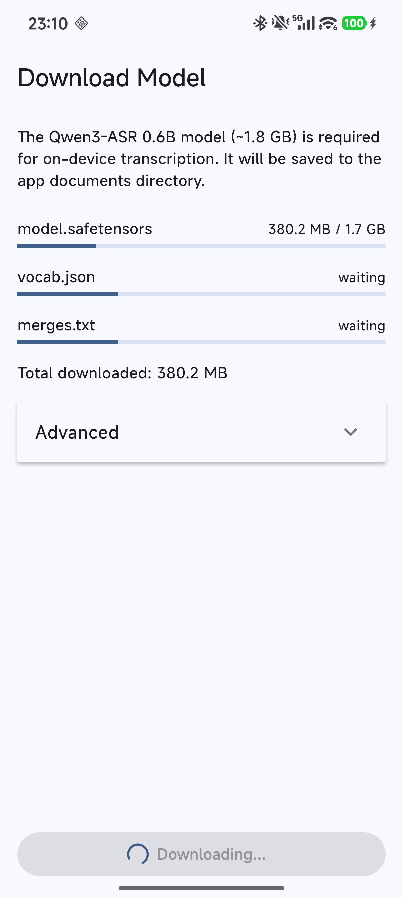
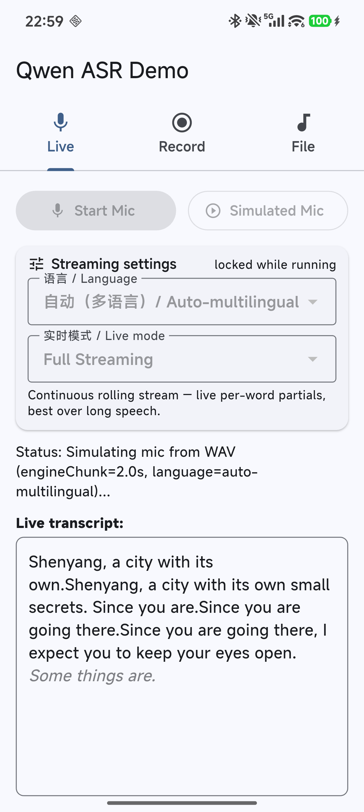
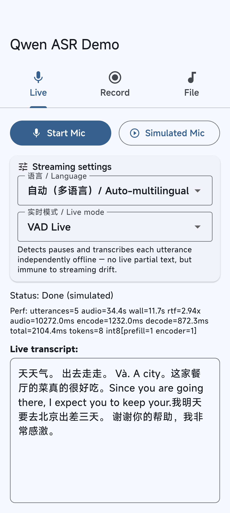
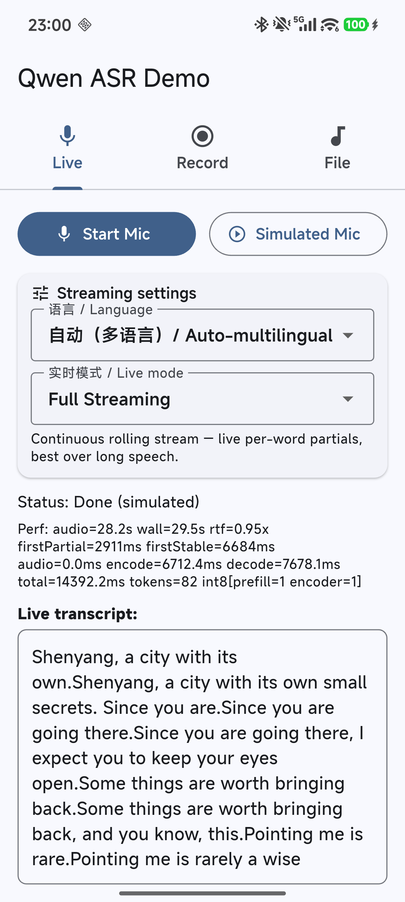
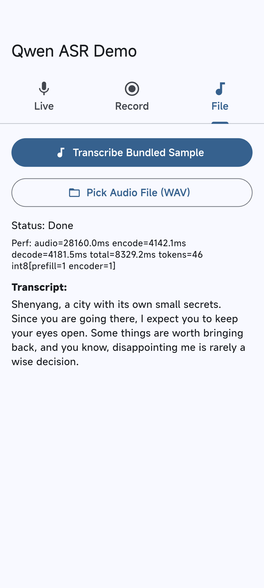
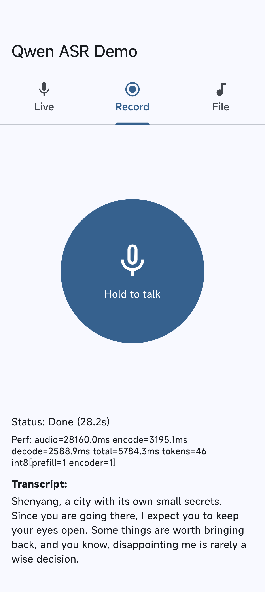

# qwen_asr example app

A reference/demo app for the [`qwen_asr`](../) plugin — on-device Qwen3-ASR
speech-to-text, pure Rust, no cloud. It exists to show integrators how to wire up
the plugin's one-shot and streaming APIs end to end; it is a demo, not a polished
consumer product.

It demonstrates:

- **Model download** with a progress UI and a base-URL override for testing.
- **Live streaming** in two modes — *Full Streaming* (the plugin's rolling
  streaming engine) and *VAD Live* (an app-level pattern built on the one-shot
  API — see below).
- **File transcription** of a bundled sample and any device WAV file.
- **Push-to-talk** recording.
- **Persisted settings**: language mode and live mode.

## Running it

The native Rust engine is 10–50× slower in debug — **always run in release (or
profile)**:

```bash
cd flutter/qwen_asr/example
flutter run --release
# Android arm64 only (smaller, faster build):
flutter run --release --target-platform android-arm64
```

On first launch the app has no model and shows the download screen (~1.8 GB;
saved to the app documents directory, so it persists across reinstalls with
`adb install -r`). After the download completes the model loads (~2.5 s on a
recent phone) and the three-tab UI appears.

## Feature walkthrough

The home screen is a three-tab shell: **Live**, **Record**, **File**.

### Model download (`download_screen.dart` + `model_manager.dart`)

Shown only when the model is missing. Downloads `model.safetensors`,
`vocab.json`, and `merges.txt` from HuggingFace with a per-file progress bar and
a running byte total, writing to `<file>.part` and renaming on success so a
partial download is never mistaken for a complete one. An **Advanced** panel
exposes a **base-URL override** so you can point the download at a local test
server instead of HuggingFace. Failures wipe the partial download and offer a
retry.

### Live tab (`streaming_screen.dart`)

Two entry points — **Start Mic** (real microphone) and **Simulated Mic** (replays
a WAV through the same pipeline) — plus the streaming settings card and a live
transcript view. The **Live mode** selector chooses between two very different
architectures:

- **Full Streaming** — drives the plugin's streaming engine
  (`streamReset` / `streamPush`). Audio is pushed in ~0.5 s chunks; the engine
  decodes a rolling window and returns a `StreamPartial`. Committed **stable**
  text is rendered in normal weight and the **provisional** tail (an unconfirmed
  hypothesis that may still change) in grey italic. Best for continuous, longer
  speech with live per-word feedback.

- **VAD Live** — an **app-level** pattern, *not* a plugin engine mode. The
  [`vad`](https://pub.dev/packages/vad) package (Silero VAD via ONNX, running on
  a bundled offline model) segments the mic stream at silence boundaries in Dart
  (`vad_live_pipeline.dart`); each completed utterance is transcribed with an
  independent **one-shot offline** `transcribePcm` call — the project's most
  WER-validated decode path — via `one_shot_transcribe.dart`. There is no
  per-word partial within an utterance (a red "listening" dot / "transcribing"
  spinner stands in), but it is immune to rolling-window streaming drift by
  construction and re-detects language per utterance. This is built entirely on
  the plugin's existing one-shot API; the streaming engine is not involved.

### Record tab (`record_screen.dart`)

Push-to-talk. Hold the circular button to record (PCM16 mic samples accumulate in
memory); release to run the buffer through the one-shot offline `transcribePcm`
API and show the result. Buffers shorter than 0.3 s are treated as accidental
taps and skipped.

### File tab (`file_screen.dart`)

**Transcribe Bundled Sample** runs a no-setup WAV asset through
`transcribeWavBuffer`. **Pick Audio File (WAV)** opens the platform document
picker (Android Storage Access Framework / iOS `UIDocumentPicker`) — no runtime
storage permission needed for a single read-only pick. Only WAV (PCM16) is
supported; picks are validated by their `RIFF/WAVE` magic bytes.

### Settings (`streaming_settings.dart`)

Shown on the Live tab. Two selectors, persisted as a small JSON file in the app
documents directory and applied at the next session start (no model reload).
**Locked while a session is running.**

- **Language** — `auto-multilingual` (per-utterance re-detection), or force
  `zh` / `en` / `ja` / `ko` / `yue`.
- **Live mode** — Full Streaming or VAD Live (described above).

## Validation status

Be honest about where the numbers come from before trusting them for your own
deployment:

- **Android — validated on physical hardware.** Tested on a Snapdragon 8 Elite
  device (Xiaomi, model 24129PN74C), including real-microphone speech across
  multiple languages, with the Android-only INT8 features active on device
  (`int8[prefill=1 encoder=1]`, confirmed in `perf_stats()`). Representative
  figures on a 28.2 s clip: RTF ≈ 0.94–0.96× (real-time-paced feed), encode
  ≈ 7 s, decode ≈ 7 s, model load ≈ 2.5 s, total PSS ≈ 2.0 GB.

- **iOS — Simulator only.** The app has been exercised on the iOS **Simulator**,
  which runs on Mac-class CPU and memory and is **not** representative of a real
  iPhone's performance, thermals, or memory pressure. **Physical iOS device
  validation is still pending** — do not read the iOS Simulator behavior as a
  guarantee for on-device iPhone performance.

## Dependency notes (for maintainers)

- **`vad` package APK-size cost.** VAD Live bundles a ~1.8 MB Silero ONNX model
  as an offline asset (`assets/vad/silero_vad_legacy.onnx`) plus the onnxruntime
  native libraries (~18 MB per ABI). If APK size matters, weigh this against the
  VAD Live feature.

- **`record` `dependency_overrides` (technical debt).** `vad` constrains
  `record: ^6.1.2`, but `record_android` 1.5.2 (the 6.x native impl) fails to
  compile against the current AGP / compileSdk. `pubspec.yaml` therefore pins
  `record: ^7.1.1` via `dependency_overrides` and feeds `vad` its audio through
  `audioStream`, so `vad` never touches its own (v6-era) internal recorder — only
  the source-compatible `record` 7 types it shares. Revisit if `vad` updates its
  `record` constraint.

## Test / automation hooks

The app has `--dart-define` hooks and `QASR_METRIC` / `QASR_TRANSCRIPT` logcat
lines used to drive and verify it without manual interaction (see `main.dart` and
`streaming_screen.dart`): `DOWNLOAD_BASE_URL`, `AUTO_DOWNLOAD`, `AUTO_SIM_WAV`,
`SIM_LIVE_MODE` (`full`|`vad`), `SIM_LANGUAGE`, `SIM_ENGINE_CHUNK_SEC`, `THREADS`.
The screenshots below were captured on the Snapdragon 8 Elite device using these
hooks.

## Screenshots

Captured on the physical Android device (Snapdragon 8 Elite), release build.

| Model download | Live · Full Streaming | Live · VAD Live |
|---|---|---|
|  |  |  |
| Per-file progress + base-URL override. | Stable text (black) with the provisional tail (grey italic). | Mixed-language multi-utterance transcript from app-level VAD segmentation. |

| Streaming settings | File tab | Record tab |
|---|---|---|
|  |  |  |
| Language + live-mode selectors; `int8[prefill=1 encoder=1]` active on device. | Bundled-sample transcript via `transcribeWavBuffer`. | Push-to-talk one-shot transcription. |
