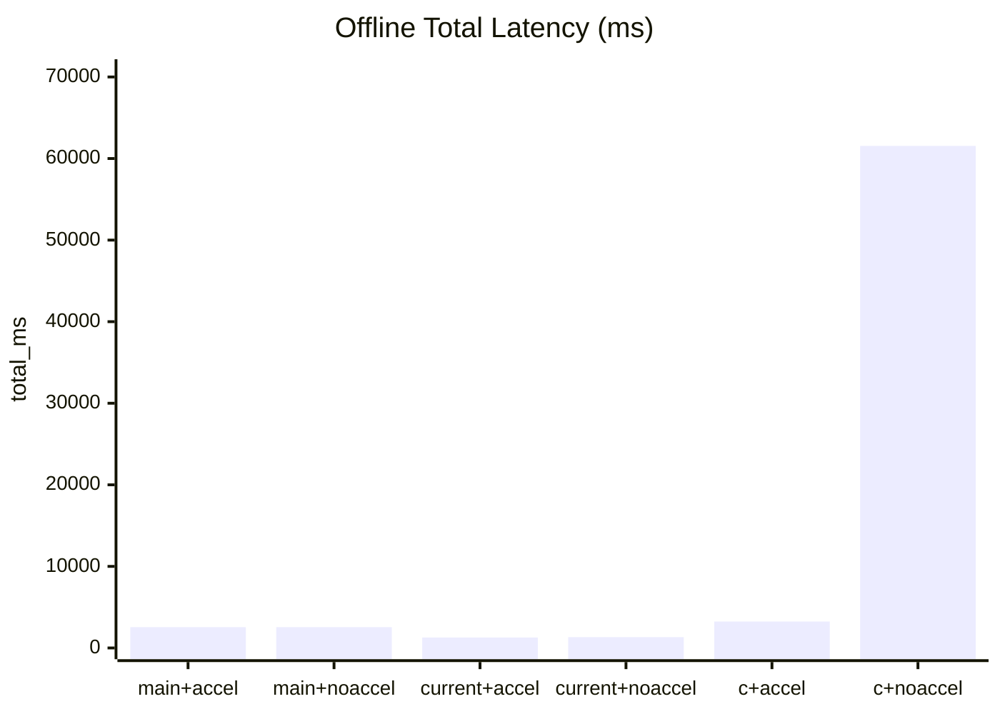
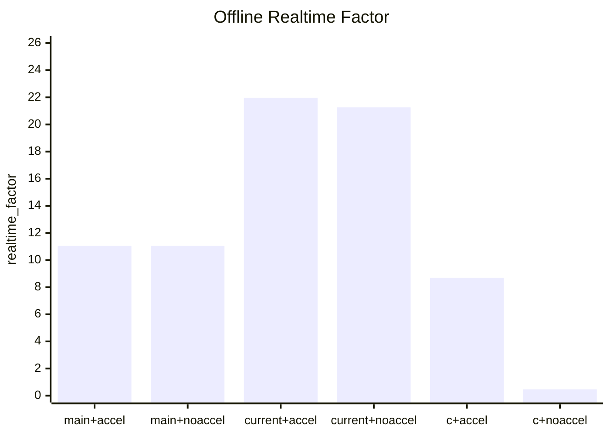

# Benchmark Report

## Methodology

- Generated with `./bench/benchmark-all.sh`.
- Raw artifacts for this run are under `bench/compare-results/20260320T114106Z/`.
- Compared three implementations on the same input WAV and model: local Rust `main`, local Rust current branch `autoresearch/perf-opt-1`, and `antirez/qwen-asr`.
- Each implementation was built twice on macOS: Accelerate enabled and disabled.
- Runs per target: `3`.
- Modes requested: `offline`.

## Environment

- Machine arch: `arm64`
- macOS: `26.3.1`
- Current branch ref: `4b895174c72ccc911c43fa716e274cd7ea395d39`
- Model dir: `/Users/lizhuo/owork/q-asr/qwen3-asr-0.6b`
- Input file: `/Users/lizhuo/owork/q-asr/bench/samples/audio.wav`

## Results

| Target | Mode | Build | Run | Total ms | RTF | Note |
|---|---:|---:|---:|---:|---:|---|
| `main+accel` | `offline` | `ok` | `ok` | `2548` | `11.05` |  |
| `main+noaccel` | `offline` | `ok` | `ok` | `2547` | `11.05` |  |
| `current+accel` | `offline` | `ok` | `ok` | `1282` | `21.97` |  |
| `current+noaccel` | `offline` | `ok` | `ok` | `1325` | `21.26` |  |
| `c+accel` | `offline` | `ok` | `ok` | `3236.484` | `8.7` |  |
| `c+noaccel` | `offline` | `ok` | `ok` | `61548.714` | `0.46` |  |

## Offline Total Latency

## Offline Realtime Factor

## Findings

- `current+accel` is about `1.99x` faster than `main+accel` on this offline benchmark (`1282 ms` vs `2548 ms`).
- `current+accel` is about `2.52x` faster than `c+accel` (`1282 ms` vs `3236.484 ms`).
- Accelerate is decisive for the C implementation (`3236.484 ms` vs `61548.714 ms`), but only a modest win for the current Rust branch (`1282 ms` vs `1325 ms`).
